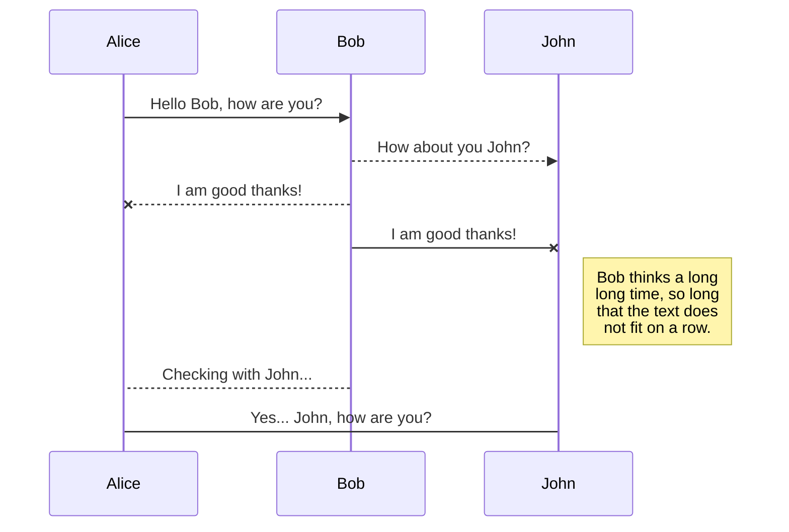

欢迎来到StackEdit！

好！我是你** StackEdit **中创建的第一个 Markdown。如果你想了解 StackEdit，可以阅读我。如果你想了解 Markdown 的功能，可以编辑我。完成之后，你可以通过打开导航栏文件右侧的**文件资源管理器**来创建新文件。


文件数

StackEdit 将您的文件放在存储浏览器中，这意味着所有文件都会自动保存到本地，并且可以离线访问！

##创建文件和文件夹

您可以通过导航栏左上角的按钮访问文件资源管理器。在文件资源管理器中，您可以点击“新建文件”按钮创建新文件，也可以点击“新建文件夹”按钮创建文件夹。

##切换到另一个文件

所有文件和文件夹都会以树状结构显示在文件资源管理器中。您可以通过单击树状结构中的文件来切换查看。

##重命名文件

您可以通过单击导航的文件名或单击文件资源管理器中的“ **重命名** ”按钮来重命名当前文件。

##删除文件

您可以通过点击文件资源管理器中的“删除”按钮来删除当前文件。该文件将被移至“恢复站”文件夹，并在7天不活动后自动删除。

##导出文件

您可以通过点击菜单中的“导出到磁盘”来导出当前文件。您可以选择将文件导出为纯Markdown格式、使用Handlebars模板的HTML格式或PDF格式。


#同步

同步是StackEdit的一大亮点。它可以让您将工作区中的任何文件与存储在** Google Drive **、** Dropbox **和** GitHub **帐户中的其他文件同步。这样，您就可以在其他设备上继续编辑，与共享文件的人协作，轻松解决您的工作流程……每分钟在后台运行同步机制，下载、合并并上传文件修改。

同步有两种类型，可以补充：

- 工作区同步功能会自动同步您的所有文件、文件夹和设置。这样您就可以在任何设备上访问您的工作区。 > 要开始同步您的工作区，只需在菜单中使用 Google 帐户登录即可。 - 文件同步功能将工作区中的一个文件与 Google 云端硬盘、Dropbox 或 GitHub 中的其他一个或多个文件保持同步。 > 开始同步文件之前，您必须在“同步”子菜单中关联一个帐户。


##打开文件

您可以通过打开“同步”子菜单并点击“从……打开”来打开来自** Google Drive **、** Dropbox **或**修改GitHub **的文件。文件在工作区打开后，都会自动同步。

##保存文件

您可以将工作区中的任何文件保存到 Google 硬盘、 Dropbox 或 GitHub，只需打开“同步”子菜单并点击“保存到”即可。即使工作区中的文件已经同步，您仍然可以将其保存到其他位置。StackEdit 可以将一个文件同步到多个位置和帐户。

## 同步文件

Once your file is linked to a synchronized location, StackEdit will periodically synchronize it by downloading/uploading any modification. A merge will be performed if necessary and conflicts will be resolved.

If you just have modified your file and you want to force syncing, click the **Synchronize now** button in the navigation bar.

> **Note:** The **Synchronize now** button is disabled if you have no file to synchronize.

## Manage file synchronization

Since one file can be synced with multiple locations, you can list and manage synchronized locations by clicking **File synchronization** in the **Synchronize** sub-menu. This allows you to list and remove synchronized locations that are linked to your file.


# Publication

Publishing in StackEdit makes it simple for you to publish online your files. Once you're happy with a file, you can publish it to different hosting platforms like **Blogger**, **Dropbox**, **Gist**, **GitHub**, **Google Drive**, **WordPress** and **Zendesk**. With [Handlebars templates](http://handlebarsjs.com/), you have full control over what you export.

> Before starting to publish, you must link an account in the **Publish** sub-menu.

## Publish a File

You can publish your file by opening the **Publish** sub-menu and by clicking **Publish to**. For some locations, you can choose between the following formats:

- Markdown: publish the Markdown text on a website that can interpret it (**GitHub** for instance),
- HTML: publish the file converted to HTML via a Handlebars template (on a blog for example).

## Update a publication

After publishing, StackEdit keeps your file linked to that publication which makes it easy for you to re-publish it. Once you have modified your file and you want to update your publication, click on the **Publish now** button in the navigation bar.

> **Note:** The **Publish now** button is disabled if your file has not been published yet.

## Manage file publication

Since one file can be published to multiple locations, you can list and manage publish locations by clicking **File publication** in the **Publish** sub-menu. This allows you to list and remove publication locations that are linked to your file.


# Markdown extensions

StackEdit extends the standard Markdown syntax by adding extra **Markdown extensions**, providing you with some nice features.

> **ProTip:** You can disable any **Markdown extension** in the **File properties** dialog.


## SmartyPants

SmartyPants converts ASCII punctuation characters into "smart" typographic punctuation HTML entities. For example:

|                |ASCII                          |HTML                         |
|----------------|-------------------------------|-----------------------------|
|Single backticks|`'Isn't this fun?'`            |'Isn't this fun?'            |
|Quotes          |`"Isn't this fun?"`            |"Isn't this fun?"            |
|Dashes          |`-- is en-dash, --- is em-dash`|-- is en-dash, --- is em-dash|


## KaTeX

You can render LaTeX mathematical expressions using [KaTeX](https://khan.github.io/KaTeX/):

The *Gamma function* satisfying $\Gamma(n) = (n-1)!\quad\forall n\in\mathbb N$ is via the Euler integral

$$
\Gamma(z) = \int_0^\infty t^{z-1}e^{-t}dt\,.
$$

> You can find more information about **LaTeX** mathematical expressions [here](http://meta.math.stackexchange.com/questions/5020/mathjax-basic-tutorial-and-quick-reference).


## UML diagrams

You can render UML diagrams using [Mermaid](https://mermaidjs.github.io/). For example, this will produce a sequence diagram:



And this will produce a flow chart:

```美人鱼
图 LR 
A[方形矩形] -- 链接文本 --> B((圆形)) 
A --> C(圆形矩形) 
B --> D{菱形} 
C --> D ```

<!--stackedit_data:
eyJoaXN0b3J5IjpbLTE2MTI0NjQ4MDddfQ==
-->